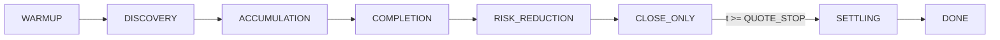
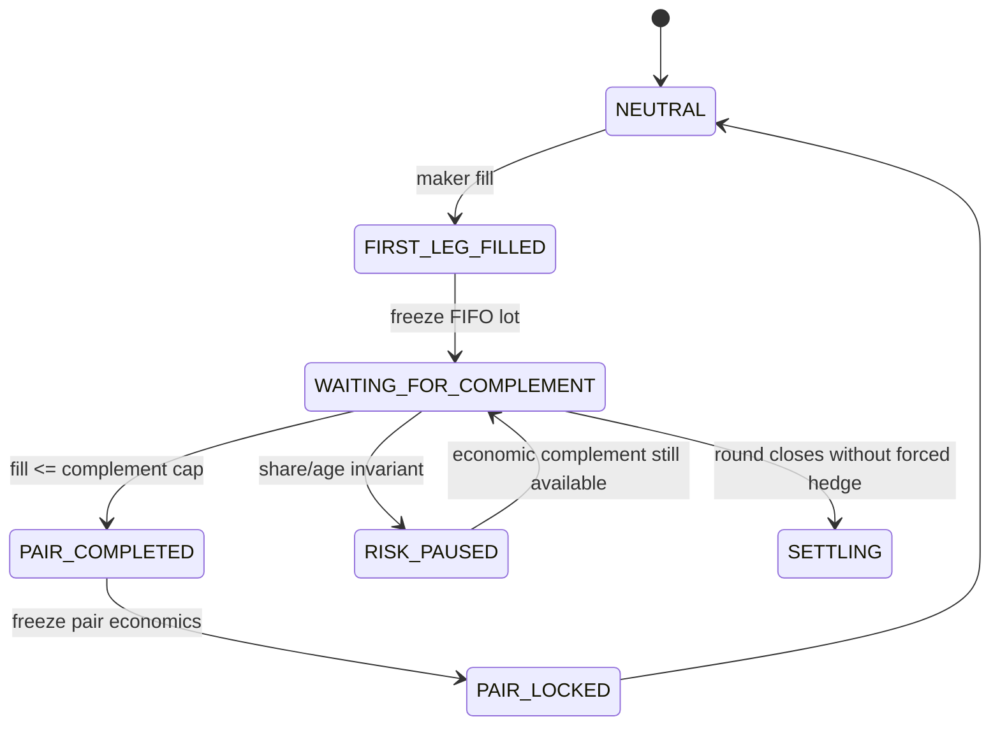

# Trading Strategy — BTC 5m V2 Pair-Cycle Engine

This document explains the **implemented** trading algorithm as it runs today
(`src/quoter.js`, `src/config.js`, `src/roundRunner.js`, `src/orderManager.js`,
`src/inventory.js`). Parameter values below are the **current code defaults**.

Measurement provenance and confidence tags (`[M]` / `[I]` / `[U]`) live next to
each knob in [`src/config.js`](src/config.js). For system layering and data flow,
see [`ARCHITECTURE.md`](ARCHITECTURE.md). Authoritative knobs are
[`src/config.js`](src/config.js) and the env overlay in
[`scripts/strategyConfig.js`](scripts/strategyConfig.js).

---

## 1. Thesis

Polymarket `btc-updown-5m-*` markets list two complementary tokens — **UP** and
**DOWN**. One UP share plus one DOWN share forms a complete set that redeems for
exactly **$1.00** at resolution, regardless of which side wins.

The active strategy is a **finite pair-cycle / marginal-economics engine**:

1. After a short warmup, post resting **buy** limits on **both** legs.
2. Sit **one tick behind** each leg’s best bid (never join the touch by default).
3. **Never sell.** Hold inventory through resolution and redeem the winner.
4. After a first-leg fill, suppress the ahead leg and quote only the
   complement at or below its FIFO lot-derived cap.

**V1** was the unrestricted two-sided accumulator reconstructed from the
source wallet. It treated `avg(UP) + avg(DOWN) < 1.00` as a measured result.
**V2** preserves the surrounding infrastructure but enforces marginal pair
economics before strategy-generated completion. Global average pair cost is
still reported for compatibility and diagnosis; it is not the control input.

There is no directional signal and no price forecast. Share tilt aligns with the
eventual winner about **48%** of the time — a coinflip paid for by unmatched
inventory. Most of the realised edge is **intra-round mean reversion** (buying
each leg on its own local dip), not the ~1¢ simultaneous-spread floor.

Liquidity-program rebates are **$0** on the source wallet and are not part of
this edge. Fees can erase the entire gross edge; verify your account’s fee
regime before live deployment.

Despite the repo folder name, this is **not** multi-wallet copy trading and
**not** rebate harvesting. “Copy” means reconstructing the observed behaviour of
wallet `0x3048d65321be3497164cdfc2996f94f98a2e7537`.

---

## 2. Market mechanics

| Item | Value |
|---|---|
| Series | `btc-updown-5m-*` |
| Round length | 300 seconds |
| Legs | `UP`, `DOWN` |
| Price unit inside the bot | integer **mils** (1000 mils = $1.00) |
| Tick in the 0.10–0.90 body | **10 mils** (1¢) |
| Tick in the tails | 1 mil (0.1¢) |
| Settlement | Winning shares → $1 each; losing shares → $0 |

Floating-point probabilities exist only at the exchange boundary. All internal
arithmetic uses mils so a one-tick offset cannot silently become 0.9999999 ticks
(`src/util.js`).

Inside the strategy’s quoting band (0.12–0.89) the tick is always 10 mils, so
“one tick behind the bid” means `bestBid − 10` mils.

---

## 3. Economic model

### Pair accounting

```
matchedShares = min(shUp, shDn)
avgUpMils     = (costUp / shUp) × 1000        # null if empty
avgDnMils     = (costDn / shDn) × 1000
pairCostMils  = avgUpMils + avgDnMils         # < 1000 ⇒ matched profit
tiltShares    = shUp − shDn                   # only directional exposure
tiltFraction  = |tilt| / (shUp + shDn)
```

Matched pairs are economically hedged: they are worth **$1** at redemption no
matter who wins. Unmatched shares are the risk.

Approximate matched profit before fees:

```
matchedPnL ≈ matchedShares × (1 − pairCostMils / 1000)
```

That global-average expression is a legacy metric. V2 control uses immutable
BUY lots and freezes each FIFO completion:

```
pairMils      = upLot.priceMils + downLot.priceMils
grossEdgeMils = 1000 − pairMils
pairEdgeUsd   = shares × grossEdgeMils / 1000
```

For an unmatched UP lot, the maximum DOWN limit is:

```
maxDownMils = PAIR_TARGET_MILS
            − upLot.priceMils
            − PAIR_EXECUTION_BUFFER_MILS
            − expectedFeeMils
```

The UP formula is symmetric. If a proposed fill spans multiple FIFO lots, V2
uses the **minimum** individual cap; it never averages lots in a way that lets
a cheap lot subsidize an expensive completion. Neutral two-sided quote sets
also validate their highest UP plus highest DOWN rung together before posting.

### Mark and settlement

```
markValue = matchedShares × 1
          + unmatchedShares × ownBestBid     # executable bid mark

PnL_UP       = UP shares − total cost − fees
PnL_DOWN     = DOWN shares − total cost − fees
WorstCasePnL = min(PnL_UP, PnL_DOWN)
```

Implemented in `RoundInventory` (`pairCostMils`, `markValueUsd`, `settle`,
`outcomeValue`, `pnlIfUpWins`, `pnlIfDownWins`, `worstCasePnl`) and the pure
helpers in `src/pairEconomics.js`.

### Where the money comes from

The book is ~1¢ wide most of the time (`bestBidUp + bestBidDown ≈ 0.99`), which
gives a small floor if both legs fill at the simultaneous touch. Resting
**behind** the touch means each fill tends to arrive when that leg has cheapened.
When the round whipsaws, both averages can land well under the complementary
sum of 1.00 — that mean-reversion capture is the main edge on the source wallet.

---

## 4. Round lifecycle

`RoundRunner` drives one 5-minute window from open to redemption.



| Regime | Default seconds | Action |
|---|---|---|
| `WARMUP` | 0–20 | No orders |
| `DISCOVERY` | 20–90 | Small neutral cycles allowed |
| `ACCUMULATION` | 90–210 | Normal bounded pair-cycle behavior |
| `COMPLETION` | 210–260 | Prioritize complements; new cycles use minimum size |
| `RISK_REDUCTION` | 260–285 | No large new unmatched position |
| `CLOSE_ONLY` | 285–300 | No new cycle; economic complements only |
| `SETTLING` | `t ≥ 300` | Cancel all; hold inventory |
| `DONE` | Resolution known | Hold winner; never sell |

Every boundary comes from the `PAIR_*_SECONDS` configuration. An approaching
round end never authorizes an unprofitable completion.

Pair-cycle state diagram:



Exit rule is absolute: the strategy never sells. Winning shares are redeemed
out of band (CTF), not by the live launcher.

---

## 5. Core decision algorithm

The entire ordinary decision surface is the pure function
`computeDesiredRungs` in [`src/quoter.js`](src/quoter.js). Given clock, books,
inventory, and guard state, it returns the exact set of resting buy orders that
**should** be live. `OrderManager` diffs that against what **is** live.

### High-level flow

```
Market book update
  → fills applied first (paper / sim)
  → RoundRunner.onBook
      → if t >= QUOTE_STOP: cancel → SETTLING
      → if t < PAIR_DISCOVERY_START: WARMUP
      → else: computeDesiredRungs → OrderManager.reconcile
```

### Gate order (exact)

Evaluated in this order:

1. **Clock before discovery** — if `t < PAIR_DISCOVERY_START_SECONDS` (20), suppress all legs.
2. **Clock after stop** — if `t >= QUOTE_STOP_SECONDS` (300), suppress all.
3. **Economic invariants** — hard-pair, unmatched-share, unmatched-age, and
   impossible two-sided-unmatched states are checked before every quote set.
4. **Inventory state** — neutral requires a jointly economic two-leg opening;
   unmatched inventory suppresses its ahead leg and selects FIFO complements.
5. **Per leg book/band gate** — a neutral cycle requires usable in-band books
   for both legs. Complement mode uses the economic cap as authority.
6. **Ladder placement** — for `i = 0 .. LADDER_LEVELS-1` (usually 2):
    ```
    mils = stepTicks(bestBid, −(offsetTicks + i))
    ```
    Default `offsetTicks = BASE_OFFSET_TICKS = 1` → rungs at bestBid−1 tick and bestBid−2 ticks.
7. **Complement/neutral cap** — clamp complement prices to the strictest FIFO
   lot cap; with neutral inventory validate the highest UP+DOWN opening pair.
8. **Sizing and risk** — cap a new cycle at `MAX_UNMATCHED_SHARES`, then apply
   the preserved dynamic sizing and round-notional budget.

Suppress reasons are enumerated as `SuppressReason` in `quoter.js` and logged for
diagnostics.

### Worked example

Suppose at `t = 45s`:

| Leg | Mid | Best bid | Near-touch bid depth (2 ticks) |
|---|---|---|---|
| UP | 0.52 (520 mils) | 0.51 (510) | 180 shares |
| DOWN | 0.48 (480 mils) | 0.47 (470) | 120 shares |

Both mids are inside 0.12–0.89. With `BASE_OFFSET_TICKS = 1` and
`LADDER_LEVELS = 2`:

| Leg | Rung 0 | Rung 1 | Aggregate neutral-cycle target |
|---|---|---|---|
| UP | 0.50 | 0.49 | 10 shares → 5 + 5 |
| DOWN | 0.46 | 0.45 | 10 shares → 5 + 5 |

Four resting buy orders, none at the touch, and no single-leg full fill can
exceed the 10-share unmatched cap. The highest opening combination is checked
against target/buffer/fees before any rung is emitted.

If UP mid later prints 0.91, the UP band gate fires and UP rungs are cancelled /
not replaced while DOWN may keep quoting if still inside the band.

---

## 6. Sizing model

Default mode is **dynamic depth sizing** (`DYNAMIC_SIZING_ENABLED: true`) — a
deliberate departure from the source wallet’s fixed ~90-share parent clips.

```
raw = RUNG_DEPTH_FRACTION × bidDepthWithin(DEPTH_SIZING_TICKS)
    = 0.10 × depth within 2 ticks of best bid

if totalNotionalUsd >= softLimit ($200):
    raw *= 0.5                    # soft shrink above ROUND_SOFT_CAP

legShares = floor(min(raw, MAX_LEG_SHARES) / step) × step
if legShares < MIN_RUNG_SHARES: legShares = 0
effectiveMin(price) = max(MIN_RUNG_SHARES, ceil($1 / price / step) × step)
split legShares across active rungs (each rung >= effectiveMin(rung.price))
if no legal rung fits: withhold the allocation

# defaults: MIN_NOTIONAL=$1, MIN_RUNG=5, MAX_LEG=20, MAX_RUNG=20, step=1
# opening (t < 30s): legShares = min(legShares, OPENING_MAX_RUNG_SHARES=20)
```

For example, a $0.10 order requires at least 10 shares. The allocator
consolidates a 10-share leg into one order rather than emitting two invalid
5-share ladder rungs. The order manager and both exchange adapters repeat this
check at submission time. A partially filled order may retain a smaller
remainder because the minimum applies to the original submission.

If dynamic sizing is disabled, fixed `RUNG_SHARES` (20) is the aggregate leg allocation.

V1 had no cost-basis feedback. V2 deliberately uses unmatched lot cost for
complement pricing and regime-based size reduction after 210 seconds. It does
not use a predictive signal or force completion near expiry.

---

## 7. Order management

`OrderManager.reconcile(desired)`:

1. If busy, replace `pendingDesired` with the newest desired state and return.
   After network I/O completes, immediately reconcile that one newest state.
2. Skip if within `MIN_REQUOTE_INTERVAL_MS` (500 ms default; override via env).
3. **Cancel** live rungs that are no longer desired (or wrong size/price).
4. **Place** missing desired rungs.
5. **Replenish** partially filled rungs only when allowed. With
   `REPLENISH_AHEAD_LEG=false`, an ahead-side fill latches suppression even if
   an older reconciliation is still in flight.

Behavioural fingerprint of the source wallet: against ~108 one-tick mid moves
per round it only gets ~12–30 filled orders — roughly **90% of posts cancel
unfilled**. Repricing is driven by book changes, not a timer.

Cancels always outrank places in the live rate limiter so stale quotes are
pulled before new ones land.

---

## 8. Round notional and tilt budgets

`ROUND_SOFT_CAP` defaults to $200 and `ROUND_HARD_CAP` defaults to $250.
Dynamic sizing halves the aggregate leg target above the soft threshold. The
hard limit includes filled cost and every desired resting buy; `MAX_TILT_SHARES`
limits one-sided directional exposure to 20 shares by default.

V2 additionally enforces `MAX_UNMATCHED_SHARES=10`,
`MAX_UNMATCHED_AGE_SECONDS=60`, and `PAIR_HARD_MAX_MILS=995`. A hard completed-
pair breach pauses the strategy and cancels quotes; share/age breaches stop new
cycles while still permitting an economically valid complement. These are
recoverable strategy pauses, distinct from fatal supervisor halts.

Process-level rails (`MAX_DAILY_LOSS`, `MAX_OPEN_NOTIONAL`) live in the
supervisor and halt the process; they do not reshape quotes.

---

## 9. Paper vs live

| Aspect | Paper (`npm run paper`) | Live (`npm run live`) |
|---|---|---|
| Strategy code | Same `Engine` / `quoter` / `OrderManager` | Same |
| Exchange | `PaperExchange` | `PolymarketLiveAdapter` |
| Fills | Queue-aware sim on public book | Real CLOB + private user feed |
| Credentials | None | API key/secret/passphrase + key + `CONFIRM_LIVE` |
| Fees | `PAPER_FEE_BPS` (often 0) | `FEE_BPS` required; preflight refuses high fees |
| Notional breach | Round paused | Supervisor `halt()` |

Invariant for paper and replay: **market move → apply fills → then reprice**.
Strategy never “sees” a book update before simulated fills at the old prices.

PAPER remains queue-aware and uses configured placement/cancel latency and a
trade-fraction haircut. It has no look-ahead, but public queue shrinkage cannot
separate trades from cancellations, so PAPER does **not** validate
profitability. LIVE maker fills asynchronously record best-bid/mid markouts at
approximately 250 ms, 500 ms, 1 s, 2 s, and 5 s for later calibration.

---

## 10. Current defaults vs source wallet

Where this deployment differs from the reconstructed source wallet
`0x3048d65321be3497164cdfc2996f94f98a2e7537`:

| Parameter | Code / launcher today | Source wallet notes |
|---|---|---|
| Entry gate | **20 s** | First fill ≥ 13 s |
| Quote stop | **300 s** (full round) | Earlier research sometimes used 240 s |
| Max leg target | **20** shares | Fixed ~90 |
| Dynamic sizing | **ON** | Effectively fixed size |
| Round budget | **$200** soft / **$250** hard | No budget |
| Tilt budget | **20** shares | Optional / unused leaks |

Treat [`src/config.js`](src/config.js) and [`scripts/strategyConfig.js`](scripts/strategyConfig.js)
as the source of truth for what will actually quote.

---

## 11. What this strategy is / is not

**Is**

- A reconstructed Polymarket BTC 5-minute complementary-pair market maker
- Passive buy-only accumulation on both UP and DOWN
- Hold-to-resolution inventory management

**Is not**

- Live copying of another wallet’s orders
- Rebate / rewards farming
- Directional BTC prediction
- A sell-to-exit or spread-crossing market maker
- A multi-strategy portfolio (one algorithm, one market series)
- A blind share balancer. Dashboard **Auto balance** refuses a FAK when the
  best executable ask exceeds the lot-derived cap and refuses to label
  flat-but-negative inventory as profit protection.

---

## 12. Code map

| Concern | Symbol / file |
|---|---|
| Desired quotes | `computeDesiredRungs`, `computeRungShares` — `src/quoter.js` |
| Complement economics | `maximumComplementPrice`, fee helpers — `src/pairEconomics.js` |
| Parameters | `PARAMS`, `GUARDS`, `MARKET` — `src/config.js` |
| Env overlay | `buildStrategyConfig` — `scripts/strategyConfig.js` |
| Round FSM | `RoundRunner`, `RoundState` — `src/roundRunner.js` |
| Cancel / place / replenish | `OrderManager` — `src/orderManager.js` |
| Manual hedge + lock | `Supervisor.autoBalance`, `RoundRunner.closeAsHedged` |
| FIFO lots, pair records, outcome/worst-case PnL | `RoundInventory` — `src/inventory.js` |
| Scheduling / fees | `Engine` — `src/engine.js` |
| Paper / live entry | `scripts/run-live.js` |
| Behavioural checklist | `TARGETS` — `src/metrics.js` |

---

## 13. Related documents

- [`ARCHITECTURE.md`](ARCHITECTURE.md) — layering, concurrency, failure model
- [`README.md`](README.md) — operator setup, paper/live rollout, env vars
- [`src/config.js`](src/config.js) — every knob with `[M]` / `[I]` / `[U]` confidence tags
